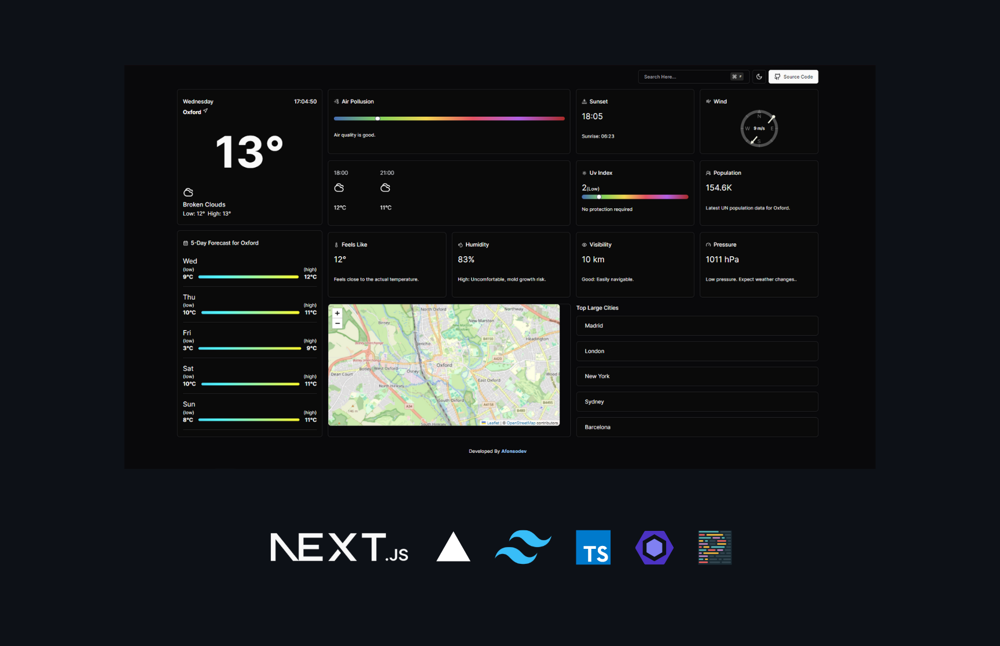

<h3 align= "center" fontSize="60px">
  Weather App
</h3>

<p align="center">
    
</p>

## :rocket: Tecnologias
-  Next.js 14
-  Typescript
-  Tailwind.css
-  OpenWeatherMap API
-  Vercel

## 💻 Sobre o projeto

Weather App é um aplicativo de previsão do tempo desenvolvido para fornecer informações meteorológicas precisas e atualizadas. Com uma interface de usuário intuitiva e recursos poderosos, o Weather App oferece uma visão completa do clima atual e das previsões futuras, permitindo que você planeje seu dia com confiança.

### Funcionalidades

- [x] **Previsão do tempo atual**: Exibe a previsão do tempo atual para a sua localização.
- [x] **Previsão do tempo de 5 dias**: Fornece uma previsão do tempo para os próximos 5 dias.
- [x] **Pesquisa de localização**: Permite pesquisar a previsão do tempo para diferentes localizações.

## :computer_mouse: Instalação e execução

Faça um clone desse repositório e acesse o diretório.

```bash
$ git clone git@github.com:afonsoburginski/Weather-App.git && cd Weather-App

# Executanto aplicação
$ yarn run dev
```

## :speech_balloon: Autor
-  [Github](https://github.com/afonsoburginski/)
-  [Linkedin](https://www.linkedin.com/in/afonsoburginski/)
-  [Email](mailto:afonsoburginski@gmail.com/)

## 📝 Licença

Esse projeto está sob a licença MIT. Veja o arquivo [LICENSE](LICENSE.md) para mais detalhes.
# Weather-App
